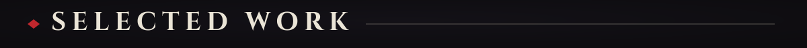
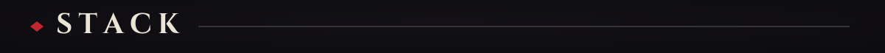
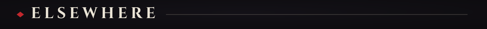
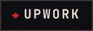

  
  
  
  
  
  <!-- If SentinelX goes public, wrap the card below in: <a href="https://github.com/nikhilsharmaa733/REPO"> ... </a> -->
  
  
  
  
  

    &nbsp;
    &nbsp;
    &nbsp;<!-- TODO: real Upwork URL -->
    <!-- TODO: real email -->
  

  

