  

I build things I want to exist — encrypted vaults, private tools, whole platforms. Sometimes for an audience of one.

The bigger credits: sole developer behind the complete digital stack of **[Shine Blue Hire Purchase](https://shinebluehpl.com)**, an RBI-registered NBFC — public web, internal platforms, and the Android apps its teams use daily. Freelance web & brand work on the side. BCA '27.

**Selected work**

- **SentinelX** — offline-first Android vault with hardware-backed encryption. `Kotlin` `Jetpack Compose` `Room` `Android Keystore` <!-- add link if it goes public -->
- **[shinebluehpl.com](https://shinebluehpl.com)** — corporate platform for an RBI-registered NBFC: six product lines, EMI calculator, full SEO build. `Next.js 15` `TypeScript` `shadcn/ui` `Vercel`
- **Payroll & Attendance** — geofenced attendance, leave, LOP payroll, PDF payslips; Android field app + web admin, in production. `Kotlin` `Compose` `Next.js` `Firebase`

**Elsewhere** — [GitHub](https://github.com/TaiyoRay) · [shinebluehpl.com](https://shinebluehpl.com) <!-- · [Upwork](YOUR_UPWORK_URL) · [email](mailto:YOUR_EMAIL) -->

  

